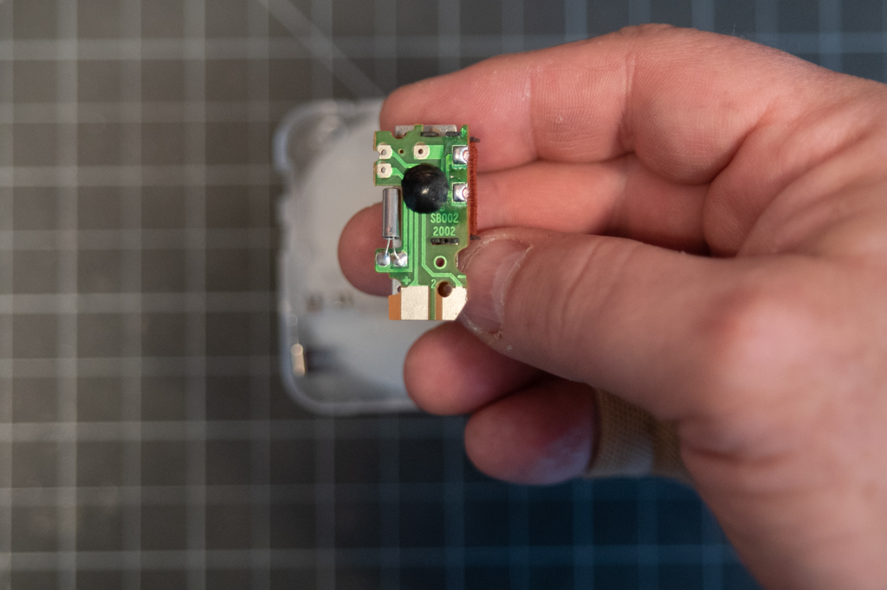
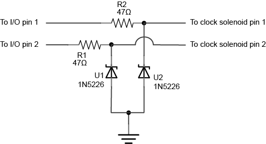

# Controlling an Analog Quartz Clock From a Microcontroller - Assembly

Following is a step-by-step illustrated guide to modifying a quartz clock mechanism so that you can control it from a microcontroller. The overview of this project is explained on the [main readme page](readme.md). The analog clock used for these images is a [Quartex Clear Clock Movement](https://www.klockit.com/quartexr-clear-quartz-clock-movement.html) from [Klockit](https://www.klockit.com/).

## Bill of Materials:
* 2 x 47-ohm diodes, e.g. Digikey  [47QBK-ND](https://www.digikey.com/scripts/DkSearch/dksus.dll?Detail&itemSeq=259581444&uq=636611085560014662)
* 2 x 1N5226 3.3V Zener diodes (or other 3.3V Zener diode), e.g. Digikey [1N5226BFSCT-ND](https://www.digikey.com/scripts/DkSearch/dksus.dll?Detail&itemSeq=259969191&uq=636611086112328034)
* [Quartex Clear Clock Movement](https://www.klockit.com/quartexr-clear-quartz-clock-movement.html)
* Small breadboard, e.g. Digikey 1738-1322-ND
* Wire wrapping wire, e.g. [Digikey K325-ND](https://www.digikey.com/product-detail/en/jonard-tools/R30B-0100/K325-ND/68411)
* Wire wrap tool, e.g. [Jameco 2150361](https://www.jameco.com/z/WWT-100-30AWG-Wire-Wrap-Tool_2150361.html)
* Breakaway header pins. Try to get longer ones if you can. Ideally 1-inch ones, e.g. [Digikey 952-1842-ND](https://www.digikey.com/products/en?keywords=952-1842-ND)

## Open the clock

Figure 1 shows the clock case from the back. The case can be tricky to open. There are two tabs on the sides, shown in Figure 2, which youll need to gently pry open with your fingers. There's also a tab by the battery case. Be careful as you open the case not to spill any of the gears. Hold it level with the back facing up.

Figure 1. Clock case from the back

Figure 2. Pry open the tabs holding the clock together gently.

## Remove the Gear train

Once you get the case open, you'll see the gear train. You can pull the black frame out as a whole and set it gently aside, and you'll see the motor exposed, as in Figure 4.

Figure 3. Inside the case you can see the gear train.

Figure 4. With most of the gears removed, the motor is exposed.

## The Clock Motor

The clock motor is a solenoid connected to a timing circuit and crystal. Figure 5 shows it flipped over to expose the circuit contacts. The bottom copper pads connect the motor to the battery contacts. You won't do anything with those, because you're powering the motor from the output pins of your microcontroller. The two soldered contacts on the right side of Figure 5 are the ones you care about. These are the solder contacts for the solenoid motor itself. Your control circuit will bypass the timing circuit on the board.

Figure 5. The clock motor's electrical contacts.

Figure 6.  Soldering to the motor's electrical contacts.

Cut two pieces of 30AWG wire wrapping wire, each about 6 to 7 inches long. Strip one inch off one end, and 1/8 inch off the other. You'll attach the 1/8-inch ends to the soldered contacts on the clock.  motor. POsition them as shown in Figure 6.

Carefully solder the wires to the existing solder pads. There may be enough solder on the pads that you don't need to add more solder. When you're done, trim off any excess wire sticking out of the solder joints. The result should look like Figure 8.  

Figure 7.  Soldering to the motor's electrical contacts.

Figure 8.  Control wires added to the motor's solder contacts.

## Re-assemble the Clock Case

Once you've soldered the wires, re-assemble the clock, starting with the motor as shown in Figure 9, then add the gear train back as shown in Figure 10.

Figure 9.  The motor back in the case.

Figure 10.  The gear train back in the case.

To get the control wires out of the case, thread them through the opening in the back of the case. If you can't do this, you might have to cut a small notch in the case. These wires are delicate, and can be cut by the case when you snap it back together. The final assembly will look like Figure 12.

Figure 11. Control wires threaded through the case back.

Figure 12. The modified clock, re-assembled. Note the clock wires coming out of the opening.

## Wire Wrap the Header Pins

The wire wrapping tool allows you to wrap 30AWG wire very tightly around a header pin. Carefully thread the 1-inch ends of the control wires into the side hole in the wire wrapping tool, as shown in Figure 13. Holding the pins and the wire end in one hand, spin the wire wrapping tool in the other hand to wrap the wire tightly around the post. The result should look like Figure 15.

Figure 13. Detail of the end of the wire wrapping tool, showing where to insert the wire.

Figure 14. Wire wrapping the header pins.

Figure 15. The wire-wrapped header pins.

## Assemble the Circuit

The control circuit needs two Zener diodes, two 47-ohm resistors, and a breadboard. Figure 17 and 18 show the schematic and breadboard views. Figure 19 shows it fully assembled and connected to the clock.

Figure 16. The components for the control circuit.

Figure 17. Analog Clock Control, schematic view.

Figure 18. Analog Clock Control from an Arduino Uno, breadboard view

Images generated using [Fritzing](http://www.fritzing.org) and Illustrator.

Figure 19. The assembled control circuit.

Now that the circuit is assembled, you should [add some hands](../Making_Custom_Clock_Hands/readme.md) and a face and program the controller.

## Program the Microcontroller

This repository contains two Arduino-based examples, one that [works on any Arduino-compatible board](AnalogClockControl), and [one for an M0-based board](RTCAnalogClockControl), which uses the realtime clock on that processor. It also contains [an example using node.js](nodejsAnalogClockControl) and the [onoff](https://www.npmjs.com/package/onoff) package, which affords control of the GPIO pins on a Raspberry Pi or BeagleBone. Have fun!
