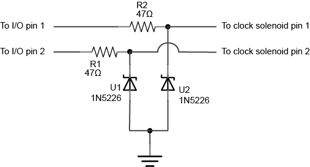
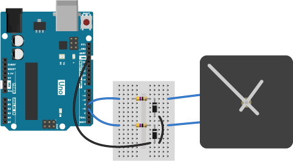
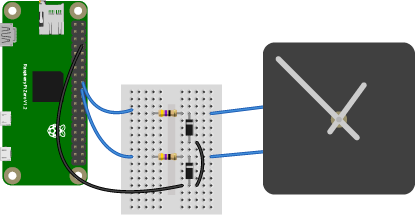

# Controlling an Analog Quartz Clock From a Microcontroller

A quartz analog clock engine is driven by a low-power solenoid which drives the gears. Matt Mets described this process well in [this blog post](http://www.cibomahto.com/2008/03/controlling-a-clock-with-an-arduino/). You can do this from a simple microcontroller like an Arduino or Arduino-compatible derivative, or from an embedded Linux processor like a Raspberry Pi or BeagleBone, as long as you have digital I/O pins (GPIO) to connect to the solenoid's pins. Most quartz clocks run on one or two AA batteries, meaning that the solenoid runs on either 1.5V or 3V at most. As long as your controller's GPIO pins can output this voltage level, you're all set.

The process works like this:

1. Hold one side of the solenoid low
2. Pulse the other side low-to-high-to-low for approximately 10 milliseconds.
3. Hold the second side low, and pulse the first side.

The width of the pulse will depend on your clock motor and on the voltage of your controller. On an Arduino Uno or Raspberry Pi, 10 milliseconds seems to work well. On an M0-based board like the Arduino MKRZero or Adafruit Feather M0, you may need up to 27 milliseconds. Experiment to find the right timing for you. Too short a pulsewidth will make the second hand pulse but not move. A little too long will cause the clock to move forward more than one second. A lot too long will cause the clock to go backwards.

Similarly, there is a limit to how frequently you can pulse the pins. Less than once every 250 milliseconds caused the clock not to work for me. Your clock's behavior may vary.

As Matt describes in his post, you should use resistors on your output pins to limit the current, and diodes to prevent back voltage spikes  from the solenoid. I used 3.3V zener diodes on my circuit, and it seems to be very stable. The circuit below works for both Pi and Arduino.

### Bill of Materials:
* 2 x 47-ohm diodes, e.g. Digikey [47QBK-ND](https://www.digikey.com/scripts/DkSearch/dksus.dll?Detail&itemSeq=259581444&uq=636611085560014662)
* 2 x 1N5226 3.3V Zener diodes (or other 3.3V Zener diode), e.g. Digikey [1N5226BFSCT-ND](https://www.digikey.com/scripts/DkSearch/dksus.dll?Detail&itemSeq=259969191&uq=636611086112328034)

Analog Clock Control, schematic view. This works for most microcontrollers or embedded Linux boards.

Analog Clock Control from an Arduino Uno, breadboard view

Analog Clock Control from an Raspberry Pi Zero, breadboard view

Images generated using [Fritzing](http://www.fritzing.org) and Illustrator.

This repository contains two Arduino-based examples, one that [works on any Arduino-compatible board](AnalogClockControl), and [one for an M0-based board](RTCAnalogClockControl), which uses the realtime clock on that processor. It also contains [an example using node.js](nodejsAnalogClockControl) and the [onoff](https://www.npmjs.com/package/onoff#writevalue-callback) package, which affords control of the GPIO pins on a Raspberry Pi or BeagleBone.
