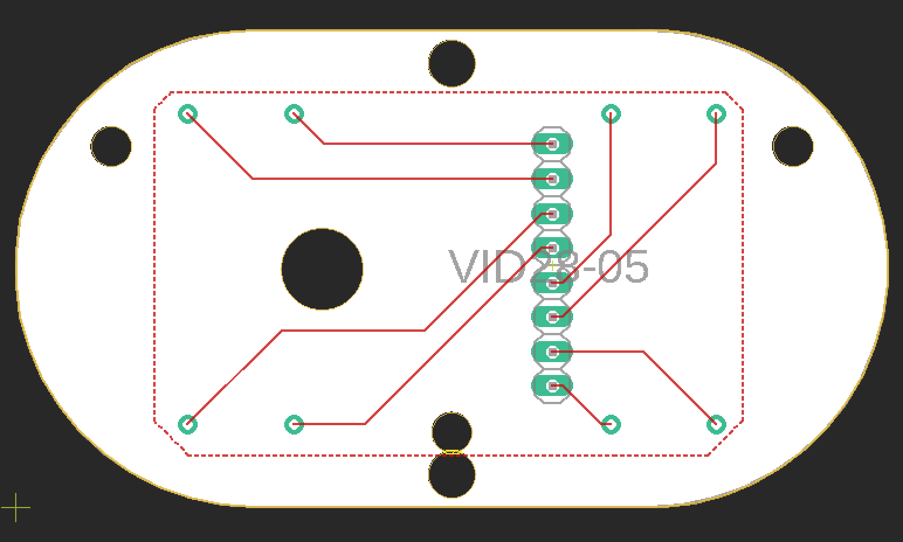

# Notes on the VID28-05

The VID28-05 is a part containing two stepper motors with concentric shafts. Orginally designed for speedometers and automotive gauges, it's useful for making clocks where the minute and hour hands are not coupled. It is similar to the motors used by [Humans Since 1982](https://www.humanssince1982.com/)'s clock projects (it may even be the motor they used, though I don't know directly). The steppers in the VID28-05 are 720 steps per revolution, and are capable of microstepping down to 1/12 degree per step. Even using the Arduino Stepper library, driven directly off the GPIO pins with no motor driver, you can drive this motor successfully at 720 steps/revolution.  Here is a useful and thorough [blog post](https://uhurumkate.blogspot.com/2019/03/a-million-times.html) by Dror Gluska who also worked out their own board on it.  Dror recommends using an [optical sensor](http://www.vishay.com/docs/83760/tcrt5000.pdf) for homing, which I haven't yet implemented. Dror cites many others who've worked with this device as well.

Here is the [datasheet for the VID28-05](https://drive.google.com/file/d/1MkbhhxYfAghMTaWHI6ohhUeeSNj2-6Do/view). 

## Circuit Board Design
[Ray](https://hackaday.io/Hackaray)'s page on [Hackaday](https://hackaday.io/project/7872-clock-clock-clone) includes a link to an [Eagle Library for the VID28-05](https://cdn.hackaday.io/files/7872336795648/vd28-05.lbr). There is a [board based on Ray's part design](VID28_eagle_01) in this repository. 

_Figure 1. Layout of a VID28-05 circuit board made in Eagle._ 

## Hand Design
If you're making hands, the shafts are nominally 1.5mm and 4mm diameter, but I found 1.4mm and 3.85mm were better sizes for laser cutting acrylic hands. This repository contains sample hand designs in [Vectorworks 2018](VID28-05_hands.vwx) and [SVG](VID28-05_hands.svg) formats. 

_Figure 2. Hand designs for the VID28-05._ 

## Control Programs
The VID28-05 steps at 1/2 degree per step in its standard mode, and can microstep at 1/12 degree. For clock-based projects, the standard 1/2 degree stepping works fine. 

For the tests in this repository, I used a MKR Zero board. The pin arrangement is based on the circuit board design mentioned above. I plugged the pins of the motors directly to eight contiguous pins of the MKR board for convenience. Re-arranging for another board is just a matter changing the pins in the motor instantiations

As a first [two-motor test](TwoMotorTest), I made a program to step both motors in opposite directions, with a 2-second delay in between revolutions. The fastest I could step reliably was about 1.8 milliseconds per step.

From there, I went on to test if I could run the hands as minute and second hands with discrete steps. These examples use the [RTCZero](https://www.arduino.cc/en/Reference/RTC) library. This library works on the SAMD21 processor that's in the [MKR series boards](https://store.arduino.cc/usa/catalogsearch/result/?ie=UTF-8&oe=UTF-8&q=mkr&domains=&sitesearch=) and the [Nano 33 IoT](https://store.arduino.cc/usa/nano-33-iot). It should work on any Arduino-compatible that uses a SAMD processor.  

The [Discrete Minute-Second Hand Test](DiscreteMinuteSecondHandTest) example moves the hands forward in discrete 6-degree (i.e. 60 steps per revolution) ticks. It uses the change in the ``millis()`` function rather than ``delay()`` to manage movement timing.

The [Sweep Minute-Second Hand Test](SweepMinuteSecondHandTest) moves the hands forward in a more or less continuous motion. At 720 steps per minute, the second hand is a bit jerky. 

The [second Discrete Minute-Second Hand Test](DiscreteMinuteSecondHandTest002) has a more staccato step motion. In this sketch, hands move all twelve steps at once before moving on to the rest of the program. There is a hard 2ms ``delay()`` between each step. 

The [third Discrete Minute-Second Hand Test](DiscreteMinuteSecondHandTest003) moves the second hand in discrete 6-degree ticks like the first Discrete Minute-Second Hand Test, but it moves the minute hand in a continuous sweep. Like the first Discrete test, it uses the change in the ``millis()`` function rather than ``delay()`` to manage movement timing.

