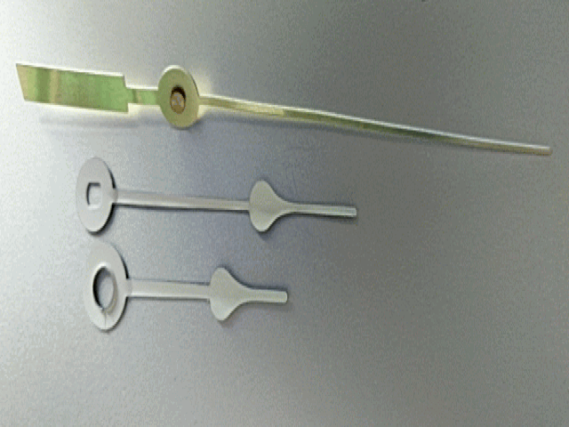
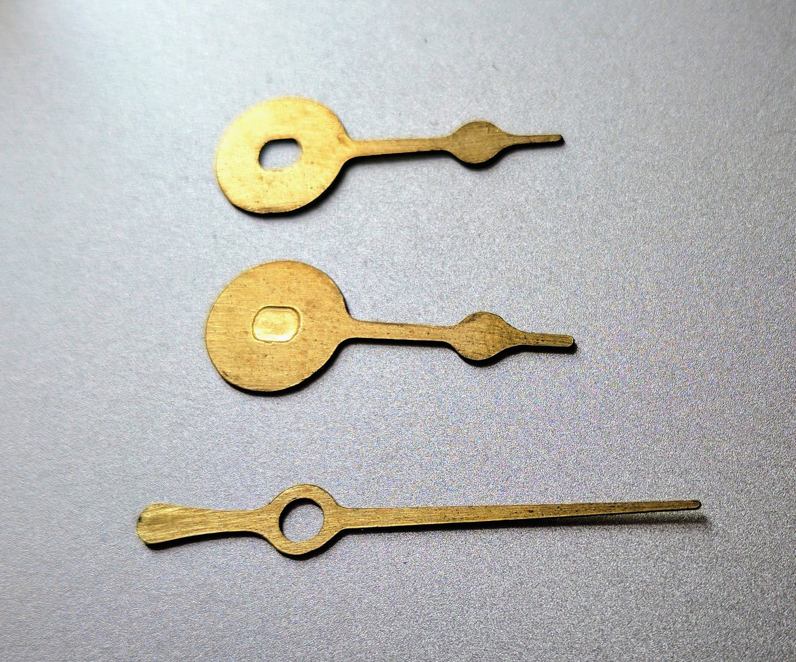
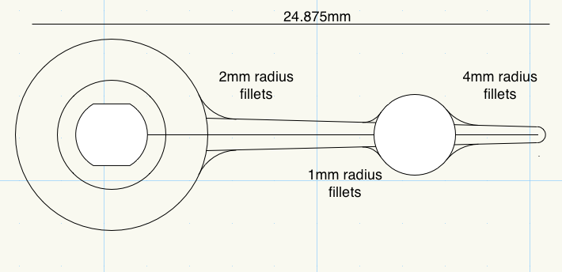

# Making Custom Clock Hands

For many different clock designs, we've been using cheap analog clock movements that you can buy in [hobby stores](https://www.michaels.com/075in-clock-movement-kit-with-small-hands-by-artminds/10475422.html) or online from sources like [Klockit](https://www.klockit.com). These clock movements have fairly standardized shaft dimensions for the hour, minute, and second hands, and you can buy a [variety of hands](https://www.michaels.com/metal-clock-hands-by-recollections/10435215.html) for them as well. We wanted to make our own hands, and experimented with milling them using an [Othermill](https://othermachine.co/), a desktop CNC mill.

## Materials

* 0.4mm brass
* Double Stick Tape
* Copper circuit board
* Acetone

## Measure The Clock Shafts

They're not all exactly the same. Here are the general dimensions we found for three or four different models:
* **hour hand**: about 5mm diameter, slightly tapered to provide tolerance for different hand designs
* **minute hand**: about 3.3to 3.4mm diameter, with two parallel flatted sides about 2.8mm apart
* **second hand**: a tapered shaft running from about 0.9mm to 1mm diameter. Most second hands are held on with a hollow pin that has a 1mm inner diameter, about 3mm outer diameter.

The dimensions of the shafts varies from manufacturer to manufacturer and model to model, however, so measure the specific one you're using with good calipers. With the material we used, an error of about 0.1 - 0.2mm was workable.

## Examine Existing Hands

The hands of the clock kits we've been buying are generally made from a slightly thinner metal than we used to make our own. They are often rolled to provide more stiffness. The hour hands tend to have rolled edges on the center hole to prevent them from sagging, and the second hands are generally counterweighted to compensate for their length. All of these characteristics contribute to making the hands more stable and to stay more level when on the shaft. Since our hands are flat, we have to compensate. Making the center holes slightly smaller to make the press-fit tighter helped. We're making a clock with very small hands, so that also helped. We still chose to counter-weight the second hand.

The center pin on the second hand is the only feature we haven't yet duplicated. We took the center pin from an existing second hand for our hands.

Store bought hands. Note the rounding of the edges and the center hole in the hour hand, and the center pin on the  second hand.

Custom milled hands in progress. Note that they are totally flat, unlike the store hands. This requires tighter shaft holes.

## Draw the Hands

In designing our hands, the most important lesson was that fillets are our friends. We used a 1/16" bit to mill the hands, so we made sure to fillet the connections between elements, so the bit could turn corners easily.

Drawing of the minute hand, with fillets' radius shown.

## Mill the Hands

To mill the hands, we attached the bronze sheet to a one-sided copper-clad board for making printed circuits. It worked as an effective spoil board. We attached the bronze to the board and the board to the mill's table with double-stick tape. Then we milled the hands with a 1/16" bit. Afterwards, an acetone bath for 3 minutes made it easier to remove the hands from the board.
When removing the hands, we learned to remove gently, from the side, not from from the end.

## Finishing

We tumbled the hands in a barrel of screws and nuts to soften the edges.
