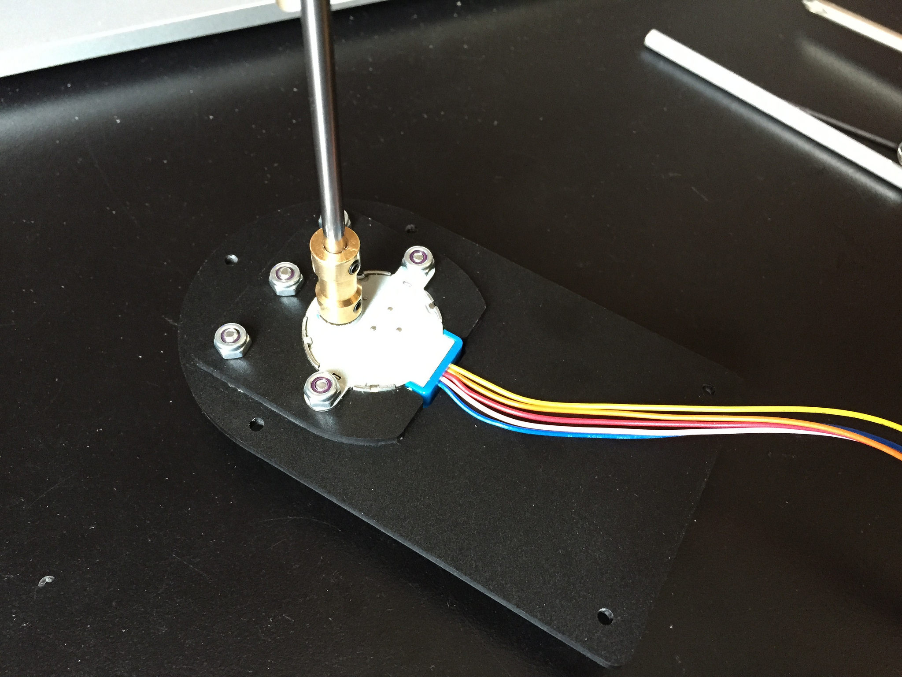
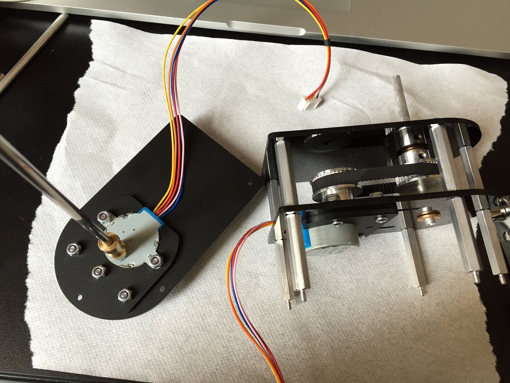
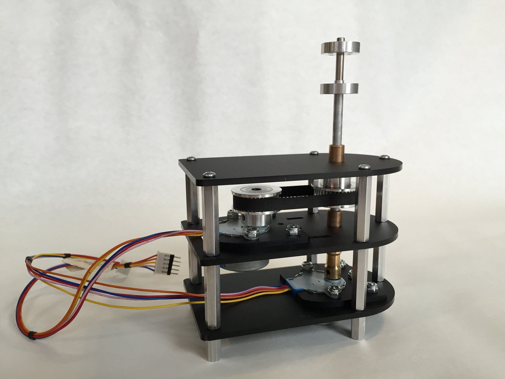

# Assembly Instructions

Mill all acrylic parts using the provided svg files: 

[Top Mounting Plate](mounting_plate_top.svg)   
[Middle Mounting Plate](mounting_plate_mid.svg)  
[Bottom Mounting Plate](mounting_plate_bot.svg)  
[Motor Clip A](motor_clipA.svg)  
[Motor Clip B](motor_clipB.svg)  

Snap motor_clipA onto each of the motors.

Insert one motor into the bottom plate and slip motor_clipB onto the bottom of the plate.  Attach 5 screws and nuts securely.

Attach shaft coupler to motor.

Attach 4mm rod to shaft coupler.  

Insert the other stepper motor into mounting_plat_mid and slip motor_clipB onto the bottom of the plate.  Attach 4 screws loosely with nuts.

Attach a timing pulley to the middle stepper motor.

Insert sleeve bearing into the mid plate and top plate.

Attach the top plate to the mid plate using the standoffs.

Insert the tube, timing pulley, and timing belt between the bearings,  The tube should rotate freely.  The timing pulley should be secured to the tube.  Do not over tighten.

Wrap the timing belt around the stepper motor timing pulley.

Adjust the middle stepper motor until the timing belt has the proper tension.  The timing belt does not need to be too taunt.  Tighten the 4 screws holding the stepper in place.

  

Attach the bottom plate assembly to the upper two plates, the 4mm shaft will go through the tube.  Screw on the five 1/2” standoffs to the bottom. 

Attach the 4mm hub to the tip of the 4mm shaft.

Attach the 5mm hun to the end of the tube.  

